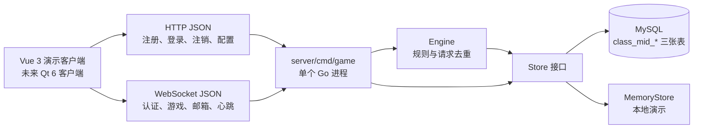
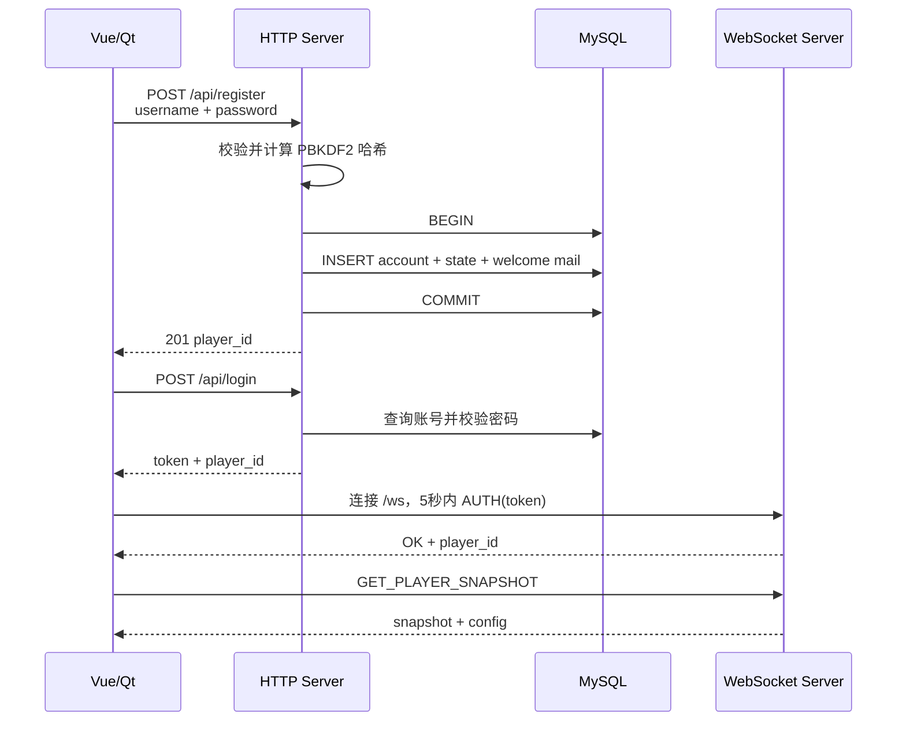
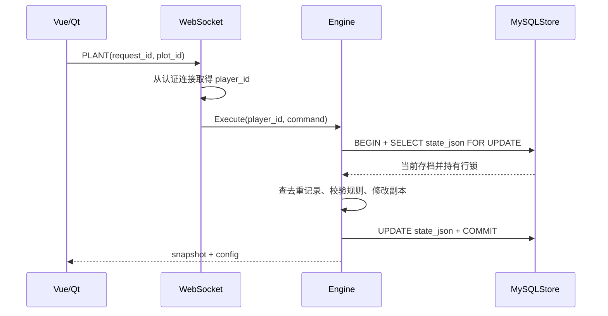
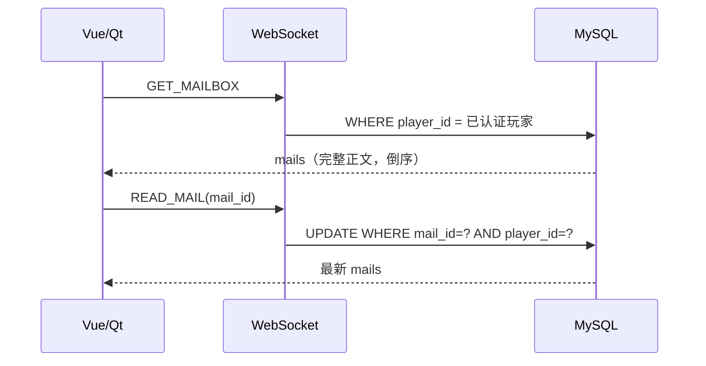

# class-mid 单服务器架构

本文只描述 `class-mid` 的当前实现。系统由一个 Go 进程、一个 Vue 演示客户端和一个 MySQL 数据库组成；未来 Qt 客户端复用相同 JSON 协议。

## 总体结构



HTTP 与 WebSocket 共用端口，默认监听 `127.0.0.1:8080`。Vue 开发服务器监听 5173，并将 `/api`、`/ws` 代理到 8080。Qt 可直接访问后端，不需要 Vue 或 Node.js。

## 模块职责

| 文件 | 主要职责 |
|---|---|
| `server/cmd/game/main.go` | 读取环境变量，选择内存/MySQL，配置连接池，启动和关闭 HTTP 服务 |
| `model.go` | 错误码、账号、农场状态、邮件、命令、响应和固定配置 |
| `rules.go` | 游戏规则、参数校验、状态版本和 request_id 去重 |
| `store.go` | Store 接口和线程安全的内存实现 |
| `mysql.go` | 三张表、注册事务、存档行锁、邮件查询和已读更新 |
| `password.go` | 账号格式、PBKDF2 密码哈希、随机玩家 ID 和 token |
| `http.go` | 注册、登录、注销、健康检查、配置以及内存 Session |
| `websocket.go` | 长连接、AUTH、玩家身份绑定、游戏与邮箱指令分发 |
| `web/src/game/client.ts` | Vue 的 HTTP/WebSocket JSON 客户端、请求匹配和心跳 |
| `web/src/App.vue` | 登录、农场、商店、任务和邮箱演示界面 |

推荐阅读顺序：`model.go → rules.go → store.go → mysql.go → password.go → http.go → websocket.go → main.go`。

## 数据设计

`class_mid_accounts` 保存 `player_id`、唯一 `username` 和 `password_hash`。`class_mid_states` 每个玩家一行，`state_json` 保存金币、物品、四块地、章节任务、版本号和最近 100 条成功写请求。`class_mid_mails` 每封邮件一行，保存归属、标题、正文、已读状态和创建时间；`(player_id, mail_id)` 索引支持倒序读取。

```mermaid
erDiagram
    CLASS_MID_ACCOUNTS ||--|| CLASS_MID_STATES : owns
    CLASS_MID_ACCOUNTS ||--o{ CLASS_MID_MAILS : receives
    CLASS_MID_ACCOUNTS {
        varchar player_id PK
        varchar username UK
        varchar password_hash
    }
    CLASS_MID_STATES {
        varchar player_id PK_FK
        json state_json
    }
    CLASS_MID_MAILS {
        bigint mail_id PK
        varchar player_id FK
        varchar title
        text content
        boolean is_read
        bigint created_at_ms
    }
```

新账号、初始状态和欢迎邮件在同一事务中创建；旧账号不补发。邮件独立于农场 JSON，标记已读不会重写整份存档。

## 注册、登录与连接



密码明文只存在于请求处理期间，数据库保存 PBKDF2 算法参数、随机盐和派生值。Session 和 token 只在 Go 进程内保存 24 小时，服务重启后重新登录。一个玩家只保留最新 WebSocket。

## 游戏写操作



行锁只锁当前玩家。同一玩家的并发写操作依次执行，不同玩家可通过连接池并行。业务函数修改副本，失败不写回；只有数据库提交成功才返回 `OK`。

每次成功写操作保存 `request_id + 指令指纹`：同编号同参数不重复扣款，同编号不同参数返回 `REQUEST_ID_CONFLICT`。读取快照、商店和心跳不改变版本。成熟时间保存在 `mature_at_ms`，读取时根据服务器时间推导成熟状态，无需后台定时器逐秒写库。

## 邮箱操作



客户端不提交 `player_id`。不存在和不属于本人的邮件统一返回 `MAIL_NOT_FOUND`，避免泄露他人邮件信息。

## 错误、恢复和取舍

- `INVALID_ARGUMENT`：JSON、字段或参数不合法。
- `UNAUTHENTICATED`：token 不存在或过期，需要重新登录。
- 明确业务失败：修正条件后使用新 request_id。
- `SERVICE_UNAVAILABLE`、超时或断线：结果可能未知，保留原 request_id 和相同参数重试。
- Vue 把一条未确认游戏写指令按玩家保存在当前标签页 `sessionStorage`；Qt 应实现等价机制。

整体 JSON 存档减少表数量和映射代码，适合课程讲解，但不适合复杂报表和超大状态。单进程没有高可用；邮箱没有附件、删除、分页和推送；当前没有自动化 Qt 测试或大规模性能结论。
