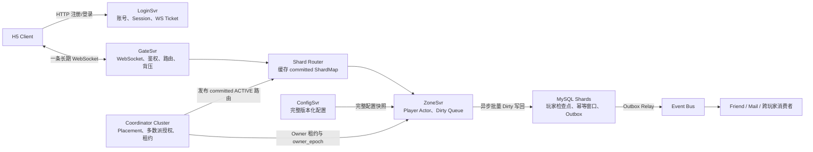

# 经典农场 V3：有状态 Zone 与异步 Dirty 落库

## 1. 当前结论

V3 保留 Player Actor、逻辑 Shard、唯一 Active Owner、租约和 epoch fencing，但用异步 Dirty 快照替代 V2 的同步 Journal。

```text
V1：无状态 Zone，每条命令依赖数据库事务
→ V2：Player Actor，响应前提交 Journal
→ V3：Player Actor，先修改内存并响应，后台批量写 MySQL
```

V3 明确接受：Zone 异常退出时，最近尚未落库的普通游戏状态可能回退。正常停机、Actor 回收和可控迁移必须先刷完 Dirty。

生产目标和本地原型是两种证据边界：

- 生产目标使用三节点多数派 Coordinator；
- 本地原型只实现接口兼容的单节点 Coordinator；
- 原型验证路由、Actor、Dirty、租约、epoch 和 fencing，不证明 3000 万 DAU 或控制面高可用。

## 2. 总体架构



普通游戏请求：

```text
Client WebSocket
→ GateSvr 认证并固定 caller_player_id
→ 按 target_player_id 计算逻辑 Shard
→ 路由到 Active Zone Owner
→ Player Actor Mailbox 串行执行
→ 修改内存、player_seq++、保存幂等结果和 Outbox
→ 标记 Dirty 并响应
→ Flusher 后台批量写 MySQL
```

## 3. 模块边界

| 模块 | 职责 |
|---|---|
| LoginSvr | 注册、密码校验、Session、一次性 WS Ticket、Gateway 地址 |
| GateSvr | 长连接认证、限流、`request_id`、Shard 路由、订阅、推送 |
| Shard Router | `player_id → shard_id → Active Zone Owner`，缓存已提交路由 |
| Placement Planner | 根据哈希、负载和故障域提出候选 Zone |
| Coordinator | 多数派提交 ShardMap、Owner 租约、`owner_epoch` 和迁移状态 |
| ZoneSvr | Player Actor、命令串行、配置快照、Dirty Queue、批量写回 |
| ConfigSvr | 全服配置权威，向 Zone 发布完整版本化快照 |
| MySQL Shards | 最近持久化玩家检查点、fence、幂等窗口和 Outbox |
| Event Bus | 承载邮件、好友和跨玩家异步副作用，不作为玩家恢复 Journal |

## 4. 登录与连接

- HTTP 处理注册、登录、Session、Gateway 发现、客户端配置引导和 WS Ticket 签发；
- 注册或登录先建立可撤销 Session，客户端再通过该 Session 获取绑定目标 Gateway、30 秒有效且一次性的 `ws_ticket`；
- 游戏命令、响应、快照和推送统一经过 Client 与 GateSvr 之间的 WebSocket；
- Client 不直接连接 Zone；
- GateSvr 从 Session 取得调用者身份，不信任消息体自报的 `caller_player_id`；
- 重复登录撤销旧 Session 并关闭旧连接。

## 5. Shard 路由与唯一 Owner

```text
shard_id = stable_hash64(target_player_id) % 4096
ShardMap[shard_id] = owner_zone_id + owner_epoch + state
```

- 4096 是版本化逻辑分片数，不等于 Zone、数据库或消息分区数量；
- 一个 Zone 持有多个 Shard；
- 同一 Shard 同一时刻只有一个写授权 Owner；
- GateSvr 只缓存已经多数派提交且状态为 `ACTIVE` 的路由；
- 普通命令不访问 Coordinator；
- 旧路由收到 `NOT_OWNER` 后刷新缓存，并复用相同 `request_id` 重试。

当前本地原型用共享 Go SDK 在 Gate 和每个 Zone 启动时同步拉取完整
ShardMap，之后通过 Coordinator 的 loopback HTTP 长轮询订阅
`map_version` 变化，并原子替换本地不可变快照。初始快照失败时服务不 Ready；
订阅中断期间现有条目仍受租约过期约束；`NOT_OWNER` 触发同步全量重取后再复用
原 `request_id`。这验证了缓存分发语义，不把 HTTP 长轮询规定为生产集群的
最终控制面传输。

### 5.1 位置建议与授权分离

Placement Planner 可以使用 Rendezvous Hashing、CPU、Actor 内存、邮箱积压、故障域和迁移并发计算候选 Zone。候选位置不授予写权限；只有生产 Coordinator 的 2/3 多数派提交后，Owner 和 `owner_epoch` 才成为权威。

### 5.2 租约

- Zone 只向当前 Coordinator Leader 续租；
- 控制面失去多数派时禁止新分配和 epoch 变化；
- 已有 Owner 只在租约有效期内继续关键写；
- 租约到期后停止关键写，查询可以按降级策略继续服务。

### 5.3 Owner 切换

```text
Placement 提出候选
→ 多数派提交 PREPARING(epoch=N+1)
→ 旧 Owner 停止接收新命令
→ 正常迁移时刷完 Dirty；故障时等待旧租约过期
→ CAS 更新 MySQL shard_fence
→ 新 Owner 加载最近玩家检查点并 Ready
→ 多数派提交 ACTIVE
→ GateSvr 获得新路由
```

MySQL fence 无法更新时，不激活新 Owner，优先避免双写。旧 epoch 的请求和 Dirty 写入必须被拒绝。

## 6. Player Actor

一个 Actor 持有一个玩家当前运行时状态：

```text
金币
仓库
农田和 Buff
当前任务章节与进度
近期 request_id 结果
player_seq
checkpoint_revision
待落库 Outbox
```

同玩家命令串行，不同玩家并行。成功写命令：

```text
Validate current state
→ Apply memory atomically
→ update in-Actor task progress when matched
→ player_seq++
→ save request result and pending Outbox
→ checkpoint_revision++
→ mark Dirty
→ reply
```

`state_version` 使用 `(owner_epoch, player_seq)`。它负责快照和推送排序，不要求所有业务命令强制匹配全局 `player_seq`；业务命令根据当前权威状态、资源条件和配置版本重新校验。

`checkpoint_revision` 是只用于检查点内容和 Dirty CAS 的持久化版本，不发送给客户端。保存确定业务失败、清理幂等窗口或对账 Outbox 会改变检查点，但不改变客户端业务状态，因此只增加 `checkpoint_revision`，不增加 `player_seq`。

第一条业务纵向闭环见 [单玩家业务架构](single-player-vertical-loop-business-architecture.md)。

## 7. ConfigSvr 与命令配置快照

- ConfigSvr 是全服配置权威；
- Zone 缓存带 `config_version` 的完整快照；
- Zone 原子替换整份快照；
- 一条命令开始时固定一个配置快照，执行过程中不得混用版本；
- 作物种植时固化成长阈值、基础速度和基础产量；
- 肥料或虫害施加时固化效果倍率和有效区间；
- 后续配置变化只影响新种植或新施加的效果。

## 8. Dirty Queue 与异步写回

Zone 使用统一 Flusher，不为每个 Actor 创建刷盘 Timer。

第一版参数和边界：

- 默认每 1 秒触发批量刷盘；
- 同一 Actor 在一个周期内多次修改只保存最新检查点；
- 按 DB Shard 分组并批量提交；
- 批次数量、单批玩家数和并发度由压测决定；
- 监控 `dirty_actor_count`、`oldest_dirty_age`、批次延迟、失败率和重试次数。

单玩家一次落库至少原子保存：

```text
player_checkpoint
+ player_seq
+ checkpoint_revision
+ owner_epoch
+ recent_request_results
+ pending_outbox_events
```

Flusher 复制 `checkpoint_revision=R` 的待保存快照：

1. 校验数据库 fence 仍属于当前 Zone 和 epoch；
2. 仅在数据库 `checkpoint_revision < R` 时更新；相同 revision 只接受相同哈希；
3. 同事务保存幂等窗口和 Outbox；
4. 提交成功且 Actor 仍为 R 时清除 Dirty；
5. Actor 已高于 R 时保留 Dirty；
6. 失败时保持 Dirty 并退避重试。

数据库异常时：

- `oldest_dirty_age` 超过 3 秒告警并开始限流；
- 接近 5 秒时停止新的关键写；
- 查询可以继续；
- 不增加本地 WAL 或 Kafka Journal 补救；
- 五秒是健康数据库条件下的目标，不是绝对保证。

## 9. 恢复、回收与迁移

### 9.1 Zone 异常退出

新 Owner 只加载 MySQL 最近检查点，不重放 Journal。未落库状态允许回退。客户端看到更高 `owner_epoch` 后，必须用完整权威快照替换本地视图。

### 9.2 Actor 回收

Actor 只有在以下条件持续满足三分钟后才能回收：

```text
玩家无在线连接
+ 无好友订阅其农场
+ Mailbox 为空
+ 无迁移或正在执行的刷盘
+ 最近无新命令
```

Dirty Actor 必须先刷盘成功；失败则继续驻留并重试。

### 9.3 正常停机或迁移

```text
停止新命令
→ 排空 Mailbox
→ 刷完 Dirty
→ 更新 fence 和 owner_epoch
→ 新 Owner 加载
→ Ready 后发布 ACTIVE
```

## 10. 任务、邮件与跨玩家边界

### 10.1 当前章节任务

当前第一版任务只依赖同一 Player Actor 已执行的购买、种植、施肥、收获和出售动作，因此任务进度与玩家状态同步更新。客户端不能上报进度。手动领取奖励也在 Actor 内原子修改金币、可入仓物品、章节状态和 `player_seq`。

该决定由 ADR-0009 记录。全服、排行榜或跨玩家任务未来可以重新评审独立 Task Service。

### 10.2 邮件

邮件仍是独立模块。任务奖励满仓时，Player Actor 创建 `CreateRewardMail` Outbox；Outbox 与玩家检查点同事务落库，Relay 成功投递后才创建邮件。

### 10.3 跨玩家

修改目标农田的投虫、捉虫和清理命令直接路由到农场主 Actor。若一个玩法同时修改两名玩家资产，则不能假装存在跨 Actor 本地事务，必须使用预留、Outbox 加补偿或邮件兜底。

当前已实现的好友投虫/捉虫是免费动作：Visitor Zone 先校验访问租约和双向好友，
再通过带路由授权头的 loopback HTTP/Protobuf 调用 Owner Zone，最终只在 Owner
Actor Mailbox 内修改地块、幂等回执和 Dirty 检查点。Visitor 不扣库存、不获奖励，
因此这里没有跨 Actor 事务，也不需要 Saga。一次 Owner Actor 事件同时扇出私有
`PLAYER_STATE_CHANGED` 和各有效访问者的公开 `FRIEND_FARM_CHANGED` 投影。

## 11. 实时同步

- WebSocket 建立在 Client 与 GateSvr 之间；
- GateSvr 先注册订阅并缓冲变化，再向目标 Zone 获取权威快照；
- Zone 返回当前 Actor 内存快照和 `(owner_epoch, player_seq)`；
- 后续推送携带连续版本；
- 版本缺口触发补发或完整重同步；
- Owner epoch 变化强制完整快照；
- MySQL 不是在线实时事实。

好友访问扩展对一次地块变化在 Actor Mailbox 内同时生成私有 `PlotView` 和公开
`PublicPlotView`：Zone 通过同一有界异步队列把私有投影推给在线 Owner，把公开
投影推给当前访问租约对应的 Visitor。两者携带相同 Owner
`(owner_epoch, player_seq)`，但不要求公开变更的 `player_seq` 连续，因为
Owner 的私有资产变化也会推进序号。当前原型只配置一个 loopback Gate Push
端点；多 Gate 连接位置注册、跨 Gate 重试和持久化 Push 不在本次实现证据内。

## 12. 规划值与验证边界

以下仍是规划假设：

| 指标 | 规划值 |
|---|---:|
| DAU | 3000 万 |
| 正常峰值在线 / WebSocket | 375 万 |
| 连接与重连压力容量 | 450 万 |
| 峰值驻留 Actor | 约 500 万 |
| 游戏应用消息峰值 | 约 6.94 万条/s |
| 逻辑玩家分片 | 4096 |
| Zone 压测前中档设计点 | 约 60 个 |

必须测量：

- Actor 状态大小、GC 和序列化成本；
- 单 Zone 命令吞吐和 Mailbox 稳定性；
- Dirty 批量快照吞吐与 p99；
- DB 故障时 Dirty 增长和限流；
- Zone 恢复加载速度；
- WebSocket 空闲连接、混合消息、心跳和重连压力；
- 最近关键时间调度器，而不是按 Actor 每秒 Tick 的生产成本。

## 13. 本地原型验收

本地原型至少验证：

1. 同玩家命令串行，不同玩家并行；
2. 一秒内多次修改合并为一次或少量 DB 写；
3. 正常停机和 Actor 回收前刷完 Dirty；
4. 强杀 Zone 后只恢复最近检查点并展示允许的回退；
5. 旧 `owner_epoch` 请求和 Dirty 写入被拒绝；
6. DB 变慢时 Dirty 指标增长并触发限流；
7. Snapshot、幂等窗口和 Outbox 原子提交；
8. 任务进度只由成功业务动作推进；
9. 两个 Zone 的路由、迁移和 fencing；
10. 单节点 Coordinator 原型不被表述为生产多数派高可用证据。
